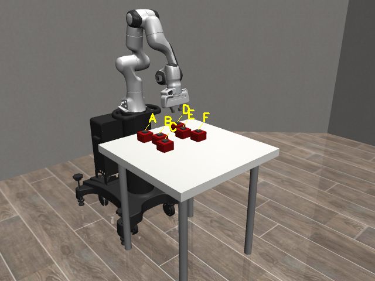
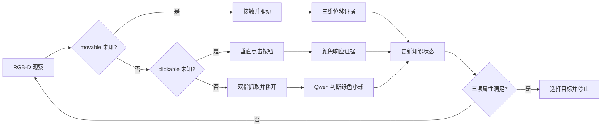
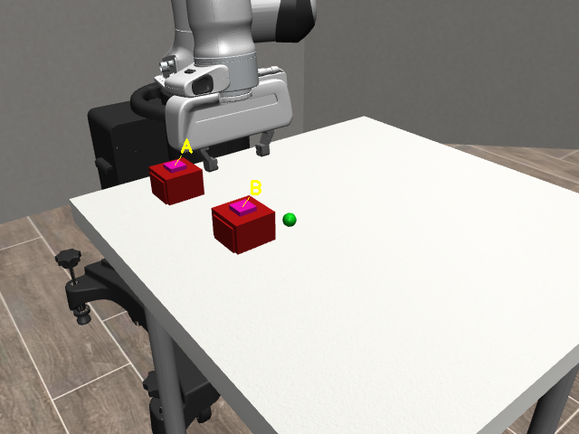
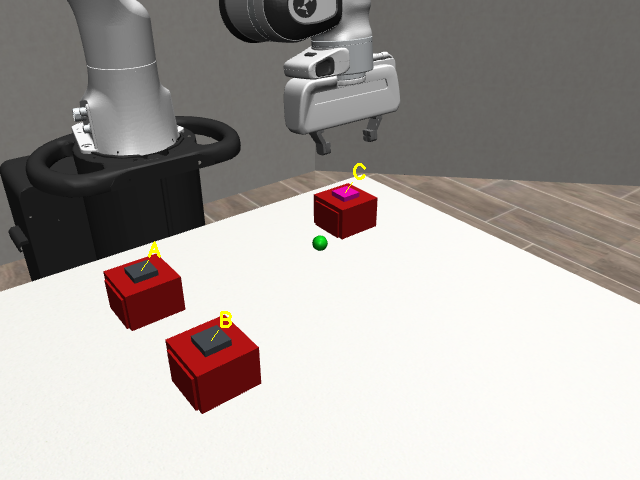
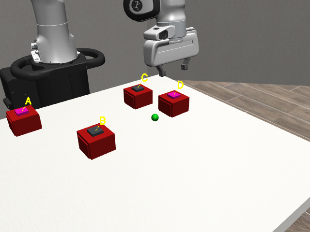
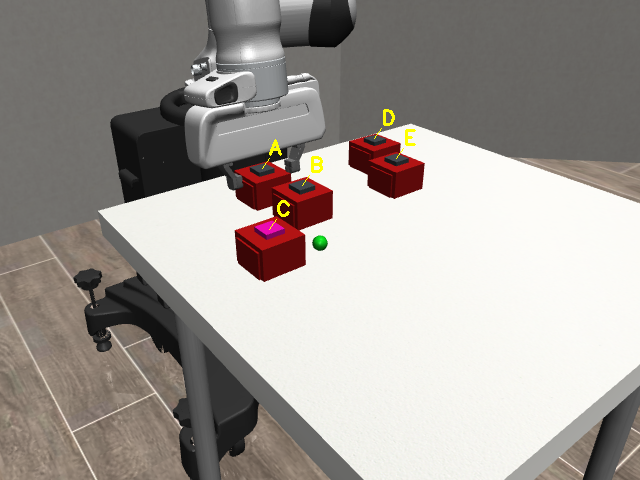
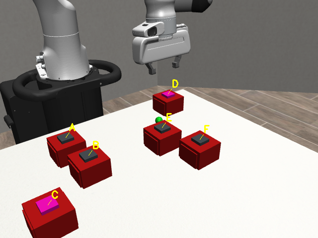
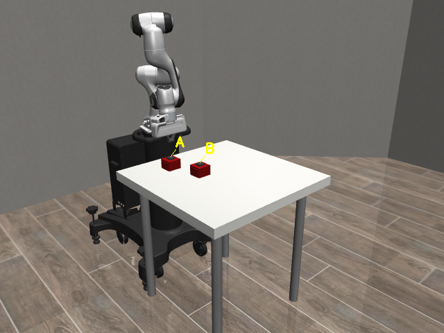
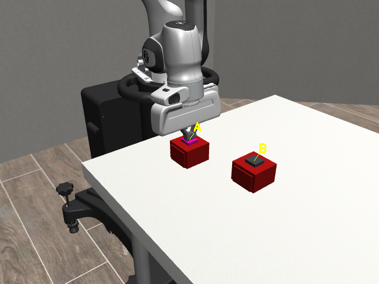
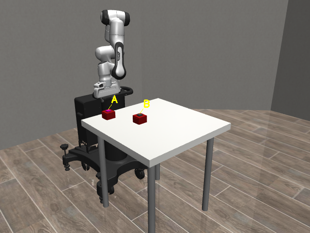

# Robot Active Perception

> 让 Panda 机械臂通过推动、点击和垂直抓取，从多个候选盒中找到“可推动、可点击且下方藏有绿色小球”的目标。



本项目在 MuJoCo / robosuite 中实现了一套可完整运行、可视化清晰、结果可追溯的机器人主动感知系统。面对 2–6 个外观相近的无底盒，机器人不会直接读取隐藏属性，而是通过真实可见的交互逐项建立证据：

1. 接触并推动盒子，通过 RGB-D 实例点云位移判断 `movable`；
2. 垂直接触顶部按钮，通过可见颜色响应判断 `clickable`；
3. 左右指垫真实接触盒体后垂直抓取，将无底盒放到旁边；
4. 本地 Qwen3-VL 查看揭示区域的 RGB 图像，独立判断是否出现绿色小球；
5. 找到同时满足三项属性的盒子后停止。

## 系统流程



每个候选严格遵循 `push → press → lift_box` 的属性依赖顺序。不满足前置属性的盒子会被立即排除，避免执行不必要的后续动作。

## 最终实验

仓库包含 2–6 盒五组完整 MP4。所有案例都经过真实 MuJoCo 运行，本地 Qwen 完成绿色小球判断，并通过视频逐帧解码与运动学指标验收。

| 场景 | 最终画面 | 目标 | 帧数 / 时长 | 完整视频 |
|---:|---|---:|---:|---|
| 2盒 |  | B | 893 / 59.5 s | [播放或下载](results/case_2_boxes.mp4) |
| 3盒 |  | C | 744 / 49.6 s | [播放或下载](results/case_3_boxes.mp4) |
| 4盒 |  | D | 1,174 / 78.3 s | [播放或下载](results/case_4_boxes.mp4) |
| 5盒 |  | C | 692 / 46.1 s | [播放或下载](results/case_5_boxes.mp4) |
| 6盒 |  | D | 1,185 / 79.0 s | [播放或下载](results/case_6_boxes.mp4) |

总体结果：

- 5 / 5 个最终案例正确找到目标；
- 4,688 / 4,688 帧全部可解码；
- 所有绿色小球判断均来自本地 Qwen3-VL，置信度均为 `high`；
- 所有抓取均通过左右指垫 MuJoCo 接触验证；
- 最低夹爪垂直对齐度为 0.9916；
- 推动前、抓取前和释放后盒体漂移均为 0；
- 最终开发版本 108 / 108 项自动化测试通过；本精简交付仓库保留的 13 / 13 项核心回归测试通过。

## 动作与证据

| 推动 | 点击 | 抓取移开 | 发现绿色小球 |
|---|---|---|---|
|  |  |  |  |

- **推动证据：** 交互前后的目标实例 RGB-D 三维质心位移，判定阈值为 0.018 m。
- **点击证据：** 顶部按钮由红色变为洋红色的可见渲染响应。
- **抓取证据：** 抬升前必须同时检测到左右 Panda 指垫与目标盒壁接触。
- **小球证据：** Qwen3-VL 输出 `true/false`、置信度、理由和原始 JSON；固定颜色规则不参与判断。

## 代码结构

```text
active_perception/
├── active_perception/
│   ├── config.py          # 配置解析与运动包络安全检查
│   ├── environment.py     # Panda、盒子、按钮和绿色球场景
│   ├── control.py         # 末端位姿控制
│   ├── perception.py      # RGB-D、分割、位移与颜色证据
│   ├── policy.py          # 属性依赖与合法动作
│   ├── qwen.py            # 本地 Qwen 推理与 JSON 解析
│   ├── runner.py          # 实验闭环、动作执行与证据记录
│   ├── state.py           # 三属性知识状态
│   └── visualization.py   # 相机、标签、状态面板与视频
├── configs/final_showcase/ # 2–6盒最终配置
├── doc/                    # 报告、海报及文档图片
├── results/                # 五组最终实验视频
├── tests/                  # 自动化验收测试
├── tools/                  # 最终案例批量运行与场景预览
├── run_experiment.py       # 单次实验入口
└── pyproject.toml          # Python依赖与测试配置
```

## 环境要求

- Linux
- Python 3.10+
- NVIDIA GPU（用于本地 Qwen 推理）
- 可用的 MuJoCo OpenGL / EGL 渲染环境
- 本地模型：`Qwen/Qwen3-VL-2B-Instruct`

安装基础依赖、运行依赖和测试依赖：

```bash
python -m pip install -e '.[runtime,dev]'
```

模型通过 Hugging Face Transformers 加载。首次运行前请确保模型已下载到本机缓存，或当前环境能够访问对应模型文件。

## 运行一个案例

```bash
NUMBA_DISABLE_JIT=1 MUJOCO_GL=glx \
python run_experiment.py \
  --config configs/final_showcase/case_4_boxes.yaml \
  --output outputs/example_4_boxes
```

输出目录包含：

- `experiment.mp4`：带动作阶段、标签和属性状态的完整视频；
- `episode.json`：决策、证据、知识状态、Qwen原始回答和最终结果；
- `observations/`：每一步的 RGB、标注图、深度、分割和相机内参；
- `last_decision.json`：最近一次动作决策。

## 顺序运行 2–6 盒最终案例

```bash
NUMBA_DISABLE_JIT=1 MUJOCO_GL=glx \
python -u tools/run_final_showcase.py
```

也可以只运行指定规模：

```bash
NUMBA_DISABLE_JIT=1 MUJOCO_GL=glx \
python -u tools/run_final_showcase.py 5 6
```

## 运行测试

```bash
python -m pytest -q tests
```

仓库内保留 13 项核心回归测试，覆盖五份最终配置与安全距离、属性验证顺序、候选跳过逻辑、双指接触语义、抓取连续性和验收阈值；完整开发版本曾执行 108 项测试并全部通过。

## 文档

- [项目报告（Markdown）](doc/project_report.md)
- [项目报告（PDF）](doc/project_report.pdf)
- [项目海报（HTML）](doc/project_poster.html)
- [项目海报（PDF）](doc/project_poster.pdf)

报告包含项目目标、系统方案、代码调用设计、2–6盒实验分析和完整指标；海报提供更浓缩的视觉介绍。

## 设计原则

- 场景真值只用于构造环境和最终评测，不直接进入感知知识状态。
- 位置接近不能替代物理接触；抓取必须通过双指接触验收。
- 搬运期间固定夹爪—盒体相对位姿，避免盒体中途脱离夹爪。
- 每个场景在启动前检查完整运动包络，盒体中心距离不得小于 0.100 m。
- 失败显式记录，不将未达到接触或运动学阈值的动作包装成成功结果。

---

课程项目实现：MuJoCo / robosuite · Panda · RGB-D · Local Qwen3-VL
