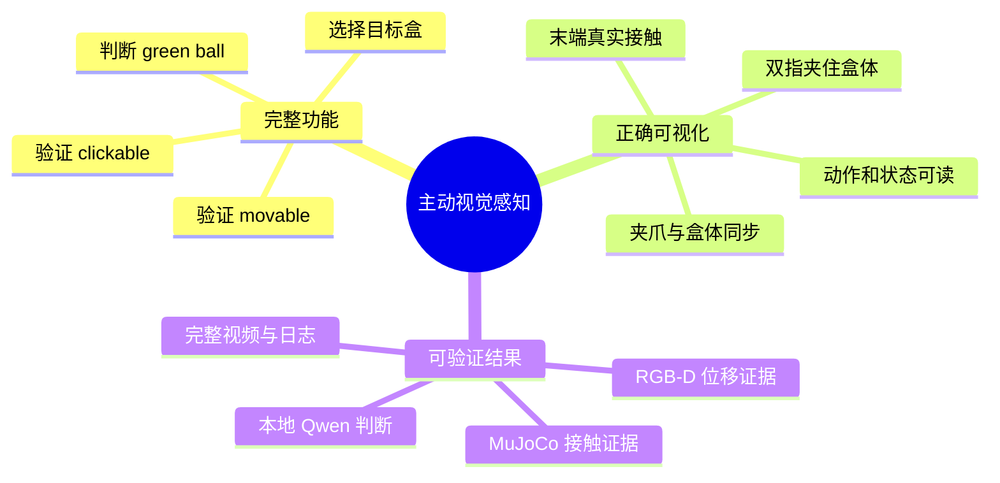
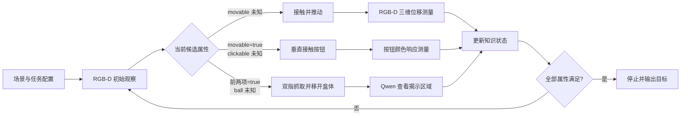
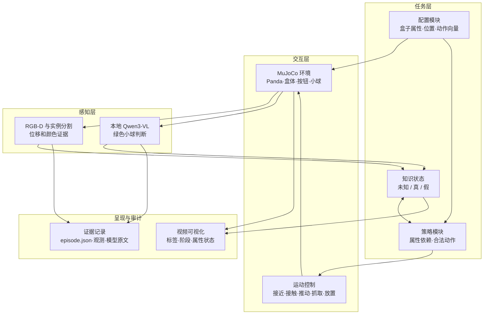
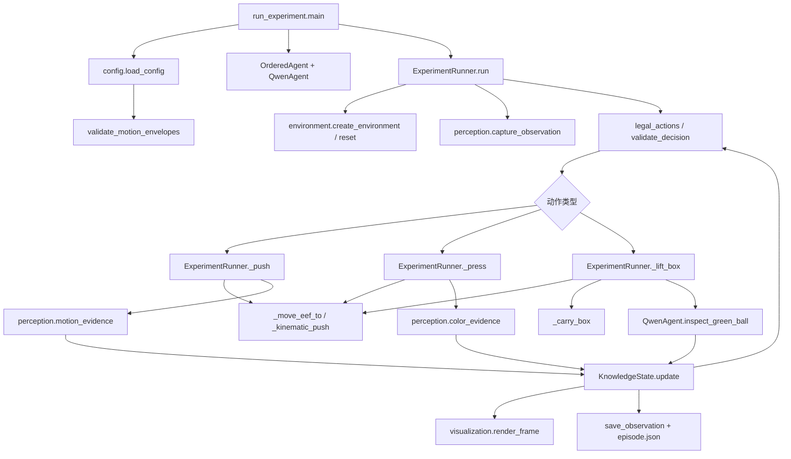
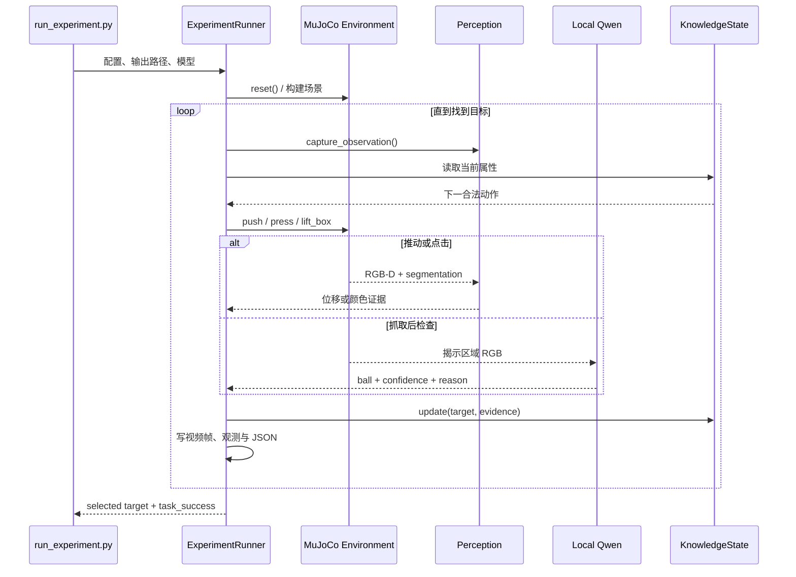
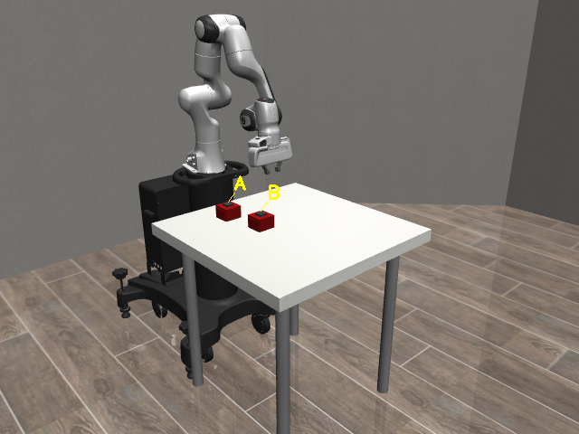
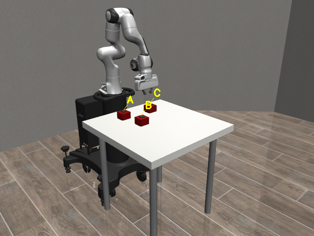
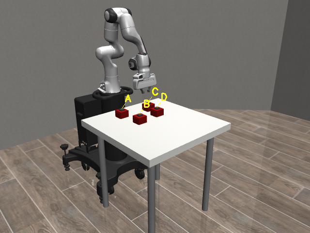
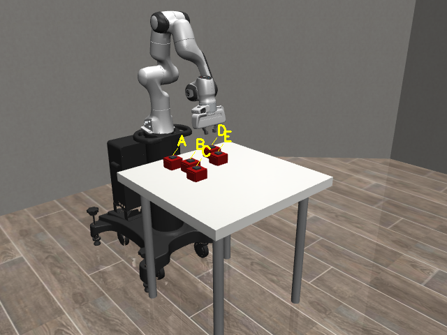
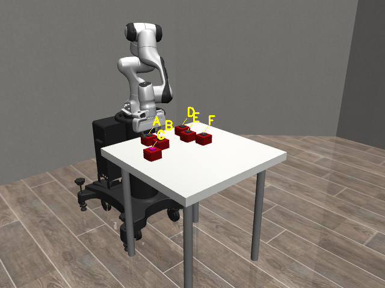

# 基于机器人交互的主动视觉属性感知系统

## 项目报告

**实验平台：** MuJoCo / robosuite · Panda 机械臂 · RGB-D · 本地 Qwen3-VL<br>
**报告实验集：** 2026-08-17 最终展示实验，覆盖 2、3、4、5、6 盒场景<br>
**实验产物：** 完整 MP4、RGB-D、实例分割、动作证据、知识状态与 Qwen 原始输出

---

## 1. 项目目标

### 1.1 背景与问题

面对外观相似的多个盒子，仅观察一张静态图像无法回答三个关键问题：盒子是否能够被推动、顶部按钮是否会响应，以及被盒体遮挡的位置是否存在绿色小球。系统因此不能只“看”，还需要主动改变场景，通过交互获得新的视觉证据。

本项目构建了一个可完整运行的主动感知闭环。Panda 机械臂按候选顺序执行推动、点击和垂直抓取；系统将每次交互产生的证据写入知识状态，逐步排除不满足条件的盒子，最终选择同时具备三个目标属性的对象。

> ## 任务目标
> **让机器人通过真实可见的交互，从 2–6 个候选盒中找到“可推动、可点击且下方藏有绿色小球”的目标盒。**

### 1.2 任务场景图

| 初始场景：多个外观相近的候选盒 | 交互结果：移开无底盒后揭示绿色小球 |
|---|---|
|  |  |

左图中盒子具有相近外观，但它们的可移动性、按钮响应和内部状态并不相同。右图展示目标盒 D 被夹爪垂直抓起并放到旁边后，原位置的绿色小球被真实揭示。标签引导线用于帮助观察者持续识别每个盒子。

### 1.3 项目目标分解



---

## 2. 系统方案

### 2.1 总体闭环



该流程把“决策—交互—测量—更新”连接成闭环。系统始终先检查 `movable`，只有盒子可推动时才验证 `clickable`；只有前两项成立时才执行成本更高的抓取与视觉判断。这样既保证逻辑清晰，也避免对已经不合格的候选执行多余动作。

### 2.2 四个核心环节

| 环节 | 功能与目标 | 证据 | 真实画面 |
|---|---|---|---|
| ① 推动 | 夹爪先接触盒体，再沿配置方向推动；确认对象是否可移动 | 交互前后实例点云三维质心位移，阈值 0.018 m |  |
| ② 点击 | 夹爪垂直向下接触顶部按钮；确认按钮是否产生响应 | 按钮由红色变为洋红色的 RGB 可见响应 |  |
| ③ 抓取 | 左右指垫同时接触盒壁后，垂直抬升并将无底盒放到旁边 | 双指 MuJoCo 接触、垂直度、携带相对位姿连续性 |  |
| ④ 识别 | 把盒体移开后的真实 RGB 图像交给本地 Qwen | `ball=true/false`、置信度、理由及模型原始 JSON |  |

### 2.3 各模块职责



- **配置模块**定义对象集合、真实属性、初始位置、推动方向、放置方向、相机和阈值，并在启动前检查完整运动包络。
- **策略模块**根据当前知识选择唯一合法的下一动作，保证所有候选都遵循 `push → press → lift_box` 的验证顺序。
- **环境与控制模块**负责构造场景和执行连续运动。抓取只有在左右指垫均形成 MuJoCo 接触后才允许抬升。
- **RGB-D 感知模块**使用实例分割锁定目标盒，通过三维点云测量移动，并通过真实渲染颜色确认按钮响应。
- **Qwen 模块**只接收盒体移开后的 RGB 图像，独立判断是否出现绿色小球；固定颜色规则不参与该结论。
- **可视化与记录模块**生成完整视频，并保存每一步的原始观测、证据、知识状态和最终结果。

### 2.4 安全与正确性约束

| 类别 | 验收指标 | 要求 |
|---|---:|---:|
| 场景安全 | 完整运动包络中心距离 | ≥ 0.100 m |
| 推动稳定 | 正式推动前盒体漂移 | ≤ 0.001 m |
| 抓取姿态 | 夹爪垂直对齐度 | ≥ 0.97 |
| 抓取成立 | 左右指垫接触 | 必须同时成立 |
| 搬运同步 | 夹爪—盒体相对位置误差 | ≤ 0.001 m |
| 搬运连续 | 合格帧比例 | ≥ 95% |
| 放置稳定 | 释放后盒体漂移 | ≤ 0.001 m |
| 视觉来源 | 绿色小球判断 | 仅本地 Qwen3-VL |
| 视频完整 | 记录帧数与解码帧数 | 完全一致 |

---

## 3. 代码设计

### 3.1 代码结构

```text
robot_codex/
├── active_perception/
│   ├── config.py          # 配置解析、类型检查、运动包络校验
│   ├── environment.py     # Panda、无底盒、按钮和绿色球场景
│   ├── policy.py          # 属性依赖、合法动作和决策校验
│   ├── control.py         # 末端位姿控制命令
│   ├── perception.py      # RGB-D、实例分割、位移与颜色证据
│   ├── qwen.py            # 本地 Qwen 推理及严格 JSON 解析
│   ├── state.py           # 每个盒子的三属性知识状态
│   ├── runner.py          # 完整实验闭环与证据记录
│   └── visualization.py   # 相机、标签、状态面板和视频帧
├── configs/final_showcase/ # 2–6盒最终展示配置
├── tests/                  # 策略、接触与验收指标回归测试
├── tools/                  # 预览、批量运行和结果分析工具
└── run_experiment.py       # 单次实验入口
```

该结构按“配置—环境—控制—感知—决策—呈现”分层。核心运行器只负责组织流程，各类测量和呈现逻辑位于独立模块，便于单独测试与定位问题。

### 3.2 函数调用图



### 3.3 单个实验的代码执行流程



### 3.4 关键设计说明

1. **真值与感知隔离。** 配置中的真实属性仅用于构造环境和最终评测，不会写入模型的知识状态。
2. **接触优先。** 推动和抓取不能用“末端接近了目标位置”替代物理接触；抬升前必须确认双指指垫接触。
3. **连续携带。** 接触成立后固定夹爪—盒体相对位姿，使视频中的盒体始终跟随夹爪，不发生中途脱离。
4. **证据可追溯。** 每一步同时保存决策、前后图像、测量值、知识状态和模型原始回答。
5. **失败显式化。** 未达到接触或位姿阈值时直接终止该次运行并记录错误，不把异常动作包装成成功结果。

---

## 4. 实验效果

### 4.1 实验设置与总体结果

最终展示集包含从 2 盒到 6 盒的五种规模。盒子数量、空间排列、可移动集合、可点击集合和目标位置均发生变化；5盒、6盒采用两排三列的纵深布局，并加入可见的位置扰动。所有案例都真实运行机械臂动作并由本地 Qwen 完成绿色小球判断。

| 规模 | 选择结果 | 动作记录 | 视频帧 | 时长 | Qwen 判断 | 结果 |
|---:|---:|---:|---:|---:|---|---|
| 2盒 | B | 7 | 893 | 59.5 s | A=false，B=true | 成功 |
| 3盒 | C | 7 | 744 | 49.6 s | C=true | 成功 |
| 4盒 | D | 10 | 1,174 | 78.3 s | A=false，D=true | 成功 |
| 5盒 | C | 7 | 692 | 46.1 s | C=true | 成功 |
| 6盒 | D | 10 | 1,185 | 79.0 s | C=false，D=true | 成功 |
| **合计** | — | **41** | **4,688** | **312.5 s** | 全部 high confidence | **5/5** |

### 4.2 2盒实验：完整对比两个候选

| 初始场景 | 最终发现目标B |
|---|---|
|  |  |

系统先完整验证 A：可推动、可点击，但Qwen判断下方无绿色小球；随后对 B 重复三项验证并发现绿色小球，最终停止于 B。该案例清楚展示了“属性部分满足并不等于目标”的逐项排除逻辑。

### 4.3 3盒实验：利用属性依赖快速筛选

| 初始场景 | 最终发现目标C |
|---|---|
|  |  |

A 在推动阶段被判定不可移动，因此不再执行点击和抓取；B 可移动但不可点击，也被提前排除；C 依次通过三项验证。该案例体现了属性依赖策略对无效动作的减少。

### 4.4 4盒实验：混合属性与较长决策路径

| 初始场景 | 最终发现目标D |
|---|---|
|  |  |

A 可推动、可点击但没有球；B 不可推动；C 可推动但不可点击；D 满足全部条件。系统累计执行 10 条动作记录和 1,174 帧视频，覆盖三种不同的候选淘汰原因。

### 4.5 5盒实验：不规则两排布局与远列目标

| 初始场景 | 最终发现目标C |
|---|---|
|  |  |

场景采用带位置扰动的两排布局。A 不可推动，B 可推动但不可点击，位于远列的 C 完成推动、点击、双指抓取和 Qwen 判断。该结果验证了机械臂在多盒遮挡和非整齐布局下仍能保持清晰的对象身份与动作逻辑。

### 4.6 6盒实验：最丰富场景与双次抓取判断

| 初始场景 | C下方无球 | D下方发现球 |
|---|---|---|
|  |  |  |

6盒场景按照 `A→B→C`、`D→E→F` 排列，A/D离机器人最近，C/F最远，并加入横纵向扰动。系统先排除 A、B，再抓取 C 并由 Qwen 判断无球，随后转向 D，完成第二次抓取并发现绿色小球。10条动作记录和79秒视频构成五组实验中最完整的长路径案例。

### 4.7 正确性验收结果

```mermaid
xychart-beta
    title "2–6盒真实实验视频帧数"
    x-axis [2盒, 3盒, 4盒, 5盒, 6盒]
    y-axis "frames" 0 --> 1300
    bar [893, 744, 1174, 692, 1185]
```

| 验收项 | 五组实验实测结果 |
|---|---:|
| 任务成功率 | 5 / 5 |
| 视频可解码 | 4,688 / 4,688 帧 |
| Qwen 来源 | 全部 `qwen_only_no_fixed_color_rule` |
| Qwen 置信度 | 全部 high |
| 双指抓取成立 | 全部通过 |
| 最低垂直对齐度 | 0.9916 |
| 最大推动前漂移 | 0 m |
| 最大抓取前漂移 | 0 m |
| 最大携带相对误差 | 约 6.21×10⁻¹⁷ m |
| 最大释放后漂移 | 0 m |
| 自动化测试 | 108 / 108 通过 |

实验结果表明，目标选择、视觉判断、抓取接触、夹爪—盒体同步和视频完整性均满足项目验收要求。最终成功案例的日志中不存在 `RuntimeError` 或异常堆栈。

---

## 5. 项目结论

本项目完成了一个由真实机器人交互驱动的主动视觉属性感知系统。系统能够在2–6盒场景中先验证可移动性，再验证按钮响应，最后通过垂直双指抓取揭示隐藏区域，并由本地Qwen判断绿色小球。五组最终实验全部正确找到目标，共生成4,688帧可完整解码的视频。

项目的主要成果不仅是正确的最终选择，还包括清晰可见的动作过程、严格的接触与同步约束、可解释的属性推理顺序，以及从原始图像到模型回答和数值指标的完整证据链。由此形成了一个功能完整、视觉表达清楚、结果可复查的机器人主动感知实现。

---

**结果位置：** `outputs/final_showcase_real_20260817/`<br>
**完整视频：** 各案例目录中的 `experiment.mp4`<br>
**结构化记录：** 各案例目录中的 `episode.json`<br>
**最终配置：** `configs/final_showcase/`
